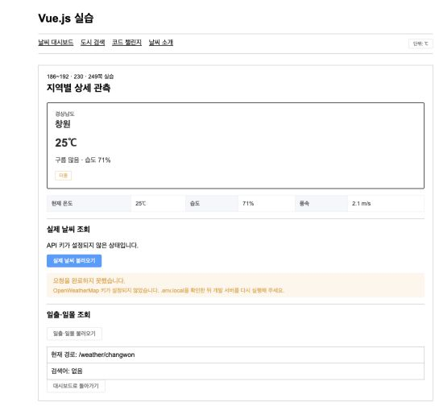

# 날씨의 요정

이번 과제에서는 제가 수업에서 배운 Vue 기능을 한 화면에 연결해 날씨 기반 이동 추천 서비스를 만들었습니다. 현재 날씨만 보여 주는 데서 끝나지 않고, 도착 예정 시각의 예보와 활동 장소를 비교해 갈 곳을 추천합니다.

- [배포 화면](https://agenticlab-sh.github.io/skala-vue/#/)
- [GitHub 저장소](https://github.com/AgenticLab-SH/skala-vue)
- [구현 기록](https://agenticlab-sh.github.io/skala-vue/#/process)
- [사용한 프롬프트](https://agenticlab-sh.github.io/skala-vue/#/prompts)
- [수업 실습 기록](https://agenticlab-sh.github.io/skala-vue/#/challenges)
- [활용자료](https://agenticlab-sh.github.io/skala-vue/#/reference)

## 과제 소개

처음 만든 화면은 서울·수원·창원·부산의 현재 날씨를 카드로 보여 주는 형태였습니다. 작업을 이어 가면서 날씨를 확인한 뒤에도 어디에서 무엇을 할지는 다시 찾아봐야 한다는 점이 아쉬웠습니다. 그래서 “정해진 시간 안에서 활동하기 나은 곳을 찾을 수 있을까?”라는 질문을 기준으로 과제 방향을 바꿨습니다.

출발 도시와 시간을 입력하면 이동 가능한 도시의 도착 예보를 비교하도록 기능을 넓혔습니다. 러닝·등산·바다·풋살·자전거마다 장소를 따로 정했고, 추천 결과에서 이동 경로와 다른 출발 시간까지 이어서 살펴보도록 구성했습니다.

## 구현 방향을 정한 과정

1. 도시 날씨 카드만으로는 목적지를 고르기 어려워 출발 시각과 이동 시간을 받는 추천으로 바꿨습니다.
2. 활동을 바꿔도 같은 장소가 나와 18개 도시의 러닝·등산·바다·풋살·자전거 장소를 따로 정리했습니다.
3. 먼 지역만 추천하지 않도록 출발 도시도 후보에 남겼습니다. 같은 도시를 고르면 시청·도청·군청에서 실제 활동 장소까지 경로를 계산합니다.
4. 시간대와 건물 높이에 따라 그늘을 보여 주는 그늘길에서 아이디어를 얻었습니다. 도착 시각의 그림자를 3D 지도에 그리고 OSRM 경로 대안의 그늘 비율과 추가 시간을 비교했습니다.
5. 화면을 직접 사용해 보면서 점수·건물 수·중복 API 정보는 덜어냈습니다. 대신 빠른 설정, 탐색 상태, 앞뒤 출발 시간과 지도 각도처럼 선택에 필요한 조작을 더 잘 보이게 했습니다.
6. 3D 지도라는 점을 알아보기 어려워 출발 조건, 추천 결과, 이동 경로, 시간 변경 순서로 화면을 나눴습니다. 이동 경로에 들어가면 지도가 확대되는 과정도 바로 보여 줍니다.

## 주요 기능

최종 화면에는 아래 기능을 구현했습니다.

1. 출발 도시·시각·30분~5시간의 최대 이동 시간과 활동을 입력해 목적지를 비교합니다. 서울·창원·광주 빠른 설정을 누르면 조건이 채워지고 활동 선택으로 이어집니다.
2. 홈은 `출발 조건 → 추천 결과 → 이동 경로 → 시간 변경` 순서로 스크롤합니다. 상단 단계 목차에서는 현재 위치를 확인하고 원하는 구간으로 바로 이동합니다.
3. 출발 지역도 후보에서 빼지 않습니다. 이동 시간 안에 들어오는 전체 후보도 대표 추천 옆에 보여 줍니다. 장소를 바꾸면 추천·지도·시간 비교도 함께 바뀝니다.
4. 이동 경로 구간에 들어오면 지도가 대한민국 전체 화면에서 목적지까지 확대됩니다. 3D 건물과 도착 시각의 그림자를 표시하며 `전체보기`와 `확대보기` 버튼으로 바로 전환합니다. 데스크톱에서는 마우스로 드래그하고 모바일에서는 지도 조작을 켠 뒤 터치와 핀치로 움직입니다.
5. OSRM 경로와 추정 경로를 구분합니다. 같은 도시에서는 행정청사에서 활동 장소까지의 지역 내 경로를 사용하고 빠른 경로와 그늘 경로를 비교합니다.
6. 도시별 날씨에서는 시·도 권역과 검색어로 원하는 도시를 찾습니다. 시간대별 예보, 일출·일몰, 관심 도시와 온도 단위도 제공합니다.
7. 48개 기준 지역을 144개 표시 지점으로 나눠 비·흐림 상태를 지도에서 확인합니다. 비와 구름 모션은 콘텐츠를 가리지 않고 지도 좌표와 페이지 배경에서만 움직입니다.
8. 기준 시각보다 1·2·3시간 빠르거나 늦게 출발하는 여섯 가지 경우를 한 시간 간격으로 비교합니다. 접속하거나 새로고침하면 약 2초 동안 환영 화면이 나옵니다. 추천을 요청하면 투명 유리 레이어에서 지도 탐색 애니메이션이 한 차례 재생됩니다. 실제 비교가 더 오래 걸릴 때는 마지막 장면을 유지합니다.

## 수업 내용 적용

과제 요구사항을 빠뜨리지 않기 위해 수업 PDF를 기준으로 배운 내용과 실제 적용 파일을 정리했습니다.

### 코드 챌린지 적용

PDF에서 `Code Challenge`로 표시된 13개 주제는 모두 실행 화면으로 남겼습니다. UI Libraries 246~248쪽과 Build 270~273쪽은 한 주제가 여러 페이지에 걸쳐 있어 각 페이지로 바로 이동하게 했습니다. 그래서 목차에는 18개 페이지가 표시됩니다.

| PDF 범위와 수업 내용                   | 서비스와 실습에 적용한 곳                                                                                                                                                        | 주요 파일                                                                                    |
| -------------------------------------- | -------------------------------------------------------------------------------------------------------------------------------------------------------------------------------- | -------------------------------------------------------------------------------------------- |
| 72쪽 반응성·텍스트 보간                | 일반 변수와 `ref`의 차이를 비교했습니다. 서비스에서는 상태 문구와 수치를 `ref`로 관리해 값이 바뀌면 화면도 바로 갱신됩니다.                                                      | `SampleOne.vue`, `SampleTwo.vue`, `WeatherHomeView.vue`                                      |
| 93쪽 Vue 디렉티브                      | `v-if`로 로딩·오류·빈 결과를 나눴습니다. 후보는 `v-for`로 반복하고 상태와 속성은 `v-bind`로 연결했습니다.                                                                        | `DirectivePractice.vue`, `WeatherHomeView.vue`, `CandidateCard.vue`                          |
| 105쪽 이벤트                           | 클릭·제출·이벤트 객체·수식어를 실습했습니다. 추천 폼은 `@submit.prevent`로 처리하고 후보 카드는 선택 내용을 부모 컴포넌트에 전달합니다.                                          | `EventPractice.vue`, `PlannerForm.vue`, `CandidateCard.vue`                                  |
| 115쪽 폼과 스타일                      | `v-model`의 입력 요소·수식어를 실습하고 출발지·날짜·시간·활동 입력을 폼으로 구성했습니다. 전역 스타일과 scoped 스타일의 역할도 나눴습니다.                                       | `FormStylePractice.vue`, `PlannerForm.vue`, `main.css`                                       |
| 126쪽 `ref`·`reactive`                 | 입력값과 API 상태는 `ref`, 묶인 실습 객체는 `reactive`로 관리했습니다.                                                                                                           | `ReactivePractice.vue`, `WeatherHomeView.vue`                                                |
| 144쪽 `computed`·`watch`·`watchEffect` | 화면에 보여 줄 값과 대표 추천은 `computed`로 만들고 출발 조건·지도 데이터 변경은 `watch`로 연결했습니다.                                                                         | `ComputedWatchPractice.vue`, `useTripPlanner.js`, `RouteMap.vue`                             |
| 155쪽 Lifecycle Hook                   | 컴포넌트가 마운트될 때 실습 타이머와 지도를 만들고 해제될 때 타이머·팝업·지도 인스턴스를 정리했습니다.                                                                           | `LifecyclePractice.vue`, `RouteMap.vue`                                                      |
| 169~171쪽 Provide / Inject             | 깊이 중첩된 하위 컴포넌트에서도 주입값을 받는 실행 예제를 실습 기록에 남겼습니다.                                                                                                | `ProvideGrandParent.vue`, `ProvideGrandChild.vue`                                            |
| 172쪽 Props & Emits                    | 입력·추천·후보·지도 컴포넌트에는 필요한 값만 props로 보냅니다. 선택·재시도·지도 모드 변경은 emits로 상위 컴포넌트에 전달합니다.                                                  | `PropsEmitsPractice.vue`, `components/planner/`                                              |
| 177쪽 Slot                             | Default·Named·Scoped Slot을 실습하고 Element Plus 카드의 header 영역도 named slot으로 구성했습니다.                                                                              | `SlotPractice.vue`, `ElementLibraryPractice.vue`                                             |
| 179~197쪽 Vue Router                   | 이동 추천, 도시별 날씨, 동적 상세, 구현 기록, 사용한 프롬프트, 실습, 활용자료와 404 페이지를 경로로 나눴습니다. 실습 목차도 Router hash로 연결했습니다.                          | `router/index.js`, `App.vue`                                                                 |
| 198~212쪽 Pinia                        | Counter Store를 실습하고 온도 단위·관심 도시·마지막 계획·화면 효과 설정을 전역 스토어에 저장했습니다.                                                                            | `counter.js`, `configStore.js`                                                               |
| 213~230쪽 Axios                        | Axios로 날씨 GET과 JSON GET·POST·PATCH·DELETE를 실습했습니다. 동기화 스크립트에는 인스턴스·params·timeout을 적용해 OpenWeather를 요청하고 Vue 앱도 Axios로 결과 파일을 읽습니다. | `AxiosWeatherPractice.vue`, `AxiosJsonPractice.vue`, `weatherApi.js`, `sync-openweather.mjs` |
| 231~249쪽 UI Libraries                 | 폼 검증, 수량·평점, 확인창·진행률을 페이지별로 구현하고 서비스 검색·알림에도 필요한 Element Plus 컴포넌트만 등록했습니다.                                                        | `ElementLibraryPractice.vue`, `main.js`                                                      |
| 250~274쪽 Vite Build & Deployment      | ESLint의 엄격 비교, Prettier, 모드별 `.env`, `dist` 빌드와 GitHub Pages base 경로를 적용했습니다.                                                                                | `CodeQualityPractice.vue`, `EnvironmentInfo.vue`, `vite.config.js`, `deploy-pages.yml`       |

### 종합과제 발전 과정

| PDF   | 수업 단계           | 현재 적용                                                                                   |
| ----- | ------------------- | ------------------------------------------------------------------------------------------- |
| 116쪽 | Weather Mockup      | `v-for`, `v-if`, 한글 입력, 카드 선택과 `.stop`을 적용한 날씨 목업을 만들었습니다.          |
| 145쪽 | Weather Composition | 검색 결과를 `computed`로 만들고 선택 도시와 검색어를 `watch`, `watchEffect`로 확인했습니다. |
| 178쪽 | Weather Component   | 검색·카드·공통 영역을 컴포넌트로 나누고 Props, Emits, Slot과 scoped style을 적용했습니다.   |
| 196쪽 | Weather Router      | 메인·검색·동적 상세·404를 지연 로딩 경로로 나누고 프로그래밍 방식 이동을 적용했습니다.      |
| 212쪽 | Weather Store       | 온도 단위와 관심 도시, 마지막 계획을 Pinia에서 관리했습니다.                                |
| 230쪽 | Weather Axios       | OpenWeather 현재·5일 예보와 JSONPlaceholder CRUD를 Axios 실습에 연결했습니다.               |
| 249쪽 | Weather UI Library  | Element Plus의 폼, 입력, 알림, 확인창과 진행률을 적용했습니다.                              |
| 274쪽 | Weather Deployment  | 환경 변수, ESLint, 모드별 빌드와 GitHub Pages 배포를 적용했습니다.                          |

## 제가 추가로 구현한 내용

코드 챌린지를 한 화면에 모은 뒤에는 날씨 정보를 실제 선택에 활용할 수 있도록 다음 기능을 더했습니다.

- 현재 날씨 카드에서 도착 예상 시각의 예보를 비교하는 이동 추천으로 확장했습니다.
- 18개 도시에 활동별 장소를 따로 두었습니다. 출발 도시도 후보에 남겨 이동 시간 안의 후보를 모두 보여 줍니다. 추천 점수는 날씨 82%와 장소 적합도 18%를 합친 뒤 이동 시간을 반영합니다. 바다는 해안 장소가 있는 도시만 비교합니다.
- OSRM 요청이 실패해도 직선거리 기반 시간과 추정선을 남기고 날씨 추천을 계속 보여 줍니다.
- 그늘길에서 아이디어를 얻어 도착 시각의 태양 고도·방위와 지도 건물 높이로 그림자를 계산했습니다. 그림자는 3D 지도에 표시하고 OSRM 경로 대안이 여러 개면 표시 구간의 그늘 비율과 추가 시간도 비교합니다.
- 전국 48개 기준 지역마다 중심권·북동권·남서권 지점을 두어 총 144개 표시 지점을 만들었습니다. 현재 강수량과 운량을 연결해 보여 주지만 행정구역 경계나 기상 레이더를 뜻하는 값은 아닙니다.
- 온도 단위, 관심 도시, 마지막 출발 조건, 날씨 효과 설정을 Pinia와 `localStorage`에 저장했습니다.
- 활동 장소의 좌표는 OpenStreetMap Nominatim에서 한 번 확인한 뒤 정적 데이터로 보관했습니다. 서비스를 사용할 때는 좌표 검색 API를 다시 호출하지 않습니다.

## 트러블슈팅 기록

기능을 하나씩 연결하면서 실제로 막혔던 문제와 해결 과정을 정리했습니다.

### OpenWeather 키가 빌드 파일에 들어갈 뻔했습니다

API 키를 GitHub Actions Secret에 넣으면 브라우저에서도 보이지 않을 거라 생각했습니다. 확인해 보니 `VITE_`로 시작하는 환경 변수는 빌드 결과에 포함될 수 있었습니다. 그래서 배포 전에 OpenWeather의 현재·5일 예보를 받아 키가 빠진 JSON으로 만들고 Vue 화면에서는 이 파일만 읽게 바꿨습니다. 이 과정에서 프런트엔드 환경 변수는 비밀을 보관하는 곳이 아니라는 점을 알게 됐습니다.



### 경로 API가 실패하면 추천 결과도 사라졌습니다

OSRM 요청이 실패하면 추천 과정 전체가 멈췄습니다. `requestDrivingRoute()` 안에서 오류를 처리하고 직선거리로 계산한 추정값을 반환하게 고쳤습니다. 이제 지도 요청을 막아도 추천 카드와 텍스트 경로는 그대로 남습니다.

### 늦게 끝난 이전 요청이 최신 결과를 덮었습니다

활동을 빠르게 바꾸면 먼저 시작한 요청이 뒤늦게 끝나 새 결과를 덮는 경우가 있었습니다. `useTripPlanner()`에 요청 번호를 두고 가장 최근에 실행한 요청만 상태를 바꾸게 했습니다. API 요청은 시작한 순서와 끝나는 순서가 다를 수 있다는 점도 이때 알았습니다.

### MapLibre 레이어가 보이지 않았습니다

콘솔을 확인해 보니 건물 높이와 기상 지점 투명도 식에서 `zoom`을 잘못 중첩한 것이 원인이었습니다. 확대 보간은 표현식 바깥으로 옮겼고 건물 바닥 높이는 데이터 값을 바로 읽게 고쳤습니다. 지도 오류는 소스·레이어·표현식을 나눠 보니 원인을 찾기 쉬웠습니다.

### 그림자는 보이는데 어느 경로가 나은지 비교할 수 없었습니다

3D 건물과 그림자만 그리면 경로까지 고를 수 있다고 생각했습니다. 하지만 경로를 하나만 요청한 상태라 비교할 대상이 없었습니다. OSRM에 경로 대안을 요청하고 현재 지도에 들어온 경로 좌표 일부를 뽑아 그림자 안에 있는 비율을 계산했습니다. 이동 시간이 10분 늘어난다면 그늘이 15%p 이상 많아야 선택되도록 감점도 넣었습니다. 경로 대안이나 건물 높이 데이터가 없을 때는 빠른 경로를 그대로 사용합니다.

### 그림자를 계산해도 지도에서 알아보기 어려웠습니다

처음 만든 그림자 레이어는 그늘 경로를 고른 뒤에만 켜졌고 지도색과 비슷해서 잘 보이지 않았습니다. 목적지 3D를 열 때도 도착 시각의 그림자를 계산하게 바꾸고 건물 아래 그림자 면을 더 짙게 조정했습니다. 지도 안에는 계산 기준 시각을 작은 범례로 남겼습니다. 지도 종류는 이동 경로와 전국 날씨만 먼저 보이고 비·흐림 필터는 날씨 지도를 연 뒤 나타납니다.

태양각 단위도 다시 살펴봤습니다. 사용 중인 SunCalc 2.0.1은 고도와 북쪽 기준 방위각을 이미 도 단위로 반환하므로 별도 변환은 넣지 않았습니다. 같은 시각의 반환값과 지도 범례를 대조한 뒤 그림자 색과 외곽선만 조정했습니다.

### 같은 도시를 선택하면 경로가 거의 보이지 않았습니다

도시마다 대표 좌표를 하나씩만 두었더니 서울에서 서울을 선택할 때 출발지와 도착지가 같은 점이 됐습니다. 출발 좌표는 각 지역의 시청·도청·군청으로 정하고 도착 좌표는 선택한 활동 장소로 나눴습니다.

### 탐색 애니메이션이 너무 빨리 사라졌습니다

추천 요청이 빠르게 끝나거나 결과 영역이 화면 아래에 있으면 로딩 애니메이션이 있어도 보이지 않았습니다. 기존 결과를 지우지 않고 화면 중앙에 고정된 투명 유리 레이어를 별도로 띄웠습니다. 처음 접속할 때 자동으로 받는 예보에는 이 레이어를 띄우지 않고 사용자가 추천을 요청했을 때만 나타나도록 분리했습니다.

원본 웰컴 애니메이션은 약 8.2초이고 지도 탐색은 약 5초라 팝업 시간과 맞지 않았습니다. 플레이어의 `ready` 시점을 재생 완료로 잘못 판단한 것도 문제였습니다. 그 때문에 완료를 감지하지 못한 팝업이 제한 시간까지 남아 있었습니다. 실제 파일이 로드된 뒤 재생을 시작하고 `complete` 이벤트를 기다리게 고쳤습니다.

웰컴과 지도 애니메이션은 각각 약 1.6초에 한 차례 재생되도록 속도를 조정했습니다. 웰컴은 마지막 장면까지 보여 준 뒤 닫힙니다. 지도 애니메이션은 한 차례 재생과 API 작업이 모두 끝나기를 기다립니다. 작업이 길어지면 반복하지 않고 마지막 장면에 머물며, 결과가 준비되는 대로 닫힙니다. 재생 오류가 생겨도 최대 대기 시간이 지나면 자동으로 종료됩니다.

### 늦게 출발하는 경우만 비교하고 있었습니다

기존 화면은 현재·3시간 뒤·6시간 뒤만 보여 줘서 비를 피해 조금 일찍 출발하는 경우를 비교하지 못했습니다. 기준보다 1·2·3시간 빠른 세 경우와 1·2·3시간 늦은 세 경우로 바꾸고 카드 안에는 도착 시각·비·기온만 남겼습니다.

### 비와 구름 때문에 어느 지역의 날씨인지 알기 어려웠습니다

첫 화면은 지도 위에 넓은 장식 효과를 사용해 배율을 바꿔도 어느 지역의 날씨인지 구분하기 어려웠습니다. 전국 48개 기준 지역을 144개 작은 지점으로 나누고 지점 좌표를 따라 짧은 빗줄기와 작은 구름이 움직이게 했습니다. 본문의 날씨 효과는 카드 위가 아닌 배경으로 내려 글과 버튼을 가리지 않게 했습니다.

### 누를 수 있는 곳이 설명 문구처럼 보였습니다

외부 날씨 비교, 빠른 설정과 지도 각도가 대표적이었습니다. 접힌 패널은 어느 곳을 눌러도 열리게 하고 포커스 상태를 눈에 띄게 바꿨습니다. 빠른 설정에서는 분위기 문구를 빼고 도시·시각·이동 시간만 남겼습니다. 지도에는 현재 회전값과 기울기를 보여 주는 조작을 추가했습니다. 개발 중에만 필요했던 점수, 건물 수, API 갱신 문구는 최종 화면에서 뺐습니다.

### 3D 지도를 그냥 지나치기 쉬웠습니다

추천 결과 아래에 지도를 바로 붙였을 때는 확대하고 회전하는 3D 지도라는 점이 잘 드러나지 않았습니다. 홈을 출발 조건, 추천 결과, 이동 경로, 시간 변경으로 나눴습니다. 이동 경로 구간에 처음 들어오면 대한민국 전체 화면에서 목적지까지 자동으로 확대됩니다. 같은 추천에서는 자동 이동을 반복하지 않습니다. 그 뒤에는 전체보기·확대보기 버튼과 드래그로 자유롭게 조작합니다.

모바일에서 한 손 드래그를 처음부터 켜면 지도가 페이지 스크롤을 가로챘습니다. 기본 상태에서는 세로 스크롤을 유지하고 `지도 조작`을 누른 동안만 한 손 이동·핀치 확대·회전을 활성화했습니다. 같은 자리에 `페이지 스크롤`을 남겨 지도 안에서도 바로 페이지 스크롤로 돌아가게 했습니다.

### OpenWeather의 한국어 날씨 설명이 어색했습니다

예보에 `온흐림`, `튼구름`, `실 비`처럼 일상에서 쓰지 않는 번역이 섞여 있었습니다. API의 한국어 설명을 그대로 출력하지 않고 `흐림`, `구름 많음`, `약한 비`로 정리하는 함수를 추가했습니다. 기존 예보 파일을 읽을 때와 새 예보 파일을 생성할 때 모두 같은 규칙을 적용해 어느 경로로 데이터를 받아도 문구가 같게 했습니다.

### Open-Meteo 요청이 막히자 지도 모션도 모두 사라졌습니다

전국 144개 지점을 네 묶음으로 나눠 Open-Meteo에 동시에 요청했지만 공개 화면에서 네 요청이 모두 `429 Too Many Requests`로 실패했습니다. 추천에 사용하는 OpenWeather 파일은 정상이었지만 전국 지도는 0개 지점으로 표시됐고 비와 구름 모션도 만들 수 없었습니다.

배포 때 한 시간마다 갱신하는 OpenWeather 18개 도시의 현재값을 전국 지도에서도 쓰도록 바꿨습니다. 각 표시 지점에는 가장 가까운 기준 도시의 기온·강수·운량을 연결합니다. 추천과 지도가 같은 파일을 읽기 때문에 외부 API 호출 제한이 생겨도 지도가 비지 않습니다.

더 자세한 기록은 배포 화면의 [구현 기록](https://agenticlab-sh.github.io/skala-vue/#/process)에 남겼습니다.

## AI 활용 범위

수업에서 다루지 않은 지도와 태양 위치 계산처럼 처음 접하는 기술은 AI의 도움을 받아 조사했습니다. 도움을 받은 범위와 실제 적용 위치는 아래 표에 구분했으며, 구현에 반영한 요청은 [사용한 프롬프트](https://agenticlab-sh.github.io/skala-vue/#/prompts)에 따로 정리했습니다.

### 수업 기술을 확장한 부분

| 기술                  | 수업에서 배운 내용          | AI 도움으로 확장한 내용                                                    |
| --------------------- | --------------------------- | -------------------------------------------------------------------------- |
| OpenWeather·환경 변수 | 날씨 API 호출과 `.env` 분리 | Actions Secret으로 배포 시점에 예보를 받아 키 없는 JSON을 만드는 구조      |
| Promise·비동기 처리   | Promise와 `async`/`await`   | `Promise.allSettled()`로 일부 실패를 허용하고 요청 번호로 최신 실행만 반영 |
| Pinia·Web Storage     | state, getter, action       | 온도 단위·관심 도시·마지막 조건·효과 설정을 `localStorage`에 보존          |

### 교재 밖에서 추가한 기술

| 기술                            | AI가 도운 부분                                      | 적용한 내용                                                                 |
| ------------------------------- | --------------------------------------------------- | --------------------------------------------------------------------------- |
| MapLibre GL JS·OpenFreeMap·OSRM | 지도 소스·레이어, 경로 대안과 카메라 이동 구조 조사 | 실제 이동선, 대한민국 전체→목적지 3D 전환, 건물, 빠른 경로와 그늘 경로 표시 |
| SunCalc·그늘 계산               | 태양 위치와 건물 그림자 계산 방법 조사              | 도착 시각의 태양 고도·방위와 건물 높이로 그림자 면과 예상 그늘 비율 계산    |
| OpenStreetMap Nominatim         | 장소 좌표를 확인하는 방법 조사                      | 활동 장소를 한 번 조회해 정적 좌표로 보관                                   |
| 추천 점수·144개 표시 지점       | 활동별 비교 기준과 지도 표시 단위 구체화            | 날씨·장소·이동 시간 점수와 48개 기준 지역의 144개 비교 지점 구성            |
| dotLottie·접근성·날씨 모션      | Vue 생명주기와 완료 이벤트 연결 방법 조사           | 웰컴·탐색 상태, 키보드 포커스, 감소된 모션과 지도 날씨 효과 적용            |

## 활용 자료

- [그늘길](https://project-g-seven.vercel.app/): 시간대와 건물 높이에 따라 그림자를 지도에 보여 주는 아이디어를 참고했습니다. 화면이나 코드는 가져오지 않았습니다. 날씨의 요정에서는 도착 시각의 그림자와 OSRM 경로 대안을 직접 비교하는 기능을 더했습니다.
- OpenWeather는 배포용 현재·예보 스냅샷과 전국 지도 기준값에 사용했습니다.
- OSRM은 자동차 이동선과 이동 시간, MapLibre GL JS와 OpenFreeMap은 경로·건물·기상 레이어 표시에 사용했습니다.
- OpenStreetMap Nominatim은 활동 장소 좌표를 한 번 확인하는 데만 사용했습니다. 확인한 좌표는 정적 데이터로 보관했습니다.
- SunCalc는 도착 시각의 태양 고도·방위 계산, SunriseSunset.io는 일출·일몰 대체 데이터에 사용했습니다.
- LottieFiles의 [Map Animation](https://lottiefiles.com/free-animation/splash-oOdsOknPhV)은 경로·날씨 탐색 중 상태 표시에, [Welcome Animation](https://lottiefiles.com/free-animation/wellcome-animation-9cXI8Bc0SU)은 접속·새로고침 뒤 환영 화면에 사용했습니다. 두 파일에는 [Lottie Simple License](https://lottiefiles.com/page/license)가 적용됩니다.

## 실행 방법

Node.js `20.19+` 또는 `22.12+`가 필요합니다.

```bash
npm ci
cp .env.example .env.local
```

`.env.local`에 발급받은 OpenWeather API 키를 작성합니다.

```env
OPENWEATHER_API_KEY=발급받은_개인_키
```

그다음 예보 파일을 만들고 개발 서버를 실행합니다.

```bash
npm run weather:sync
npm run dev
```

품질 검사와 배포용 빌드는 아래 명령으로 확인합니다.

```bash
npm run lint
npm run build:production
```

`.env.local`과 생성된 `public/data/openweather.json`은 Git에 올라가지 않습니다. `main`에 push하면 GitHub Actions가 Secret에 저장한 키로 OpenWeather 예보를 갱신한 다음 production 빌드를 GitHub Pages에 배포합니다. 한 시간마다 같은 작업을 실행해 공개 예보 파일을 새로 만듭니다.

## 참고 사항

예보와 이동 시간은 계획을 돕는 참고 정보입니다. 제주로 이동하거나 API 요청이 실패하면 추정 경로를 보여 줍니다. 그늘 우선 결과는 현재 지도에 불러온 도착지 주변 건물과 자동차 경로 대안을 비교한 값입니다. 보행 안전이나 전체 이동 구간의 그늘을 보장하지 않으므로 활동 장소의 운영 시간·예약·혼잡도는 출발 전에 따로 확인해야 합니다.
